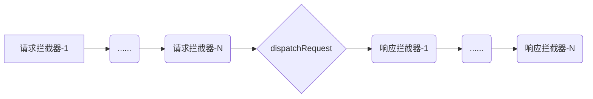

# javaScript 集训营 - 从火爆天的axios源码解析到HTTP协议与web攻防安全


## 个人介绍

```javascript
const zMouse = deepFreeze({
	name: '钟毅',
    nick: ['zMouse', '子鼠', '紫薯'],
    experience: '5年后端开发、6年前端开发经验、3+2年授课经验',
    skill: {
        BackEnd: {
            languages: ['php', 'node.js', 'other'],
            frameworks: ['TP','Symfony','Laravel','Express', 'Koa', 'Other']
        },
        FrontEnd: [
            languages: ['javascript（es6+）', 'typescript'],
        	frameworks: ['angular.js', 'angular', 'vue', 'react', 'Other']
        ]
    },
    profile: '妙味课程体系搭建者之一，曾经录制过面向对象、node.js系列、原生webComponent组件开发系列、typeScript系列、Vue系列等热门视频。妙味金牌讲师，授业传道上万名学员，教学中擅长系统讲解知识点、并能延伸扩展到整套知识体系及实际工作使用场景，让学员感受到其扎实而深入的知识脉络体系'
});
```


**出题啦**

deepFreeze （深度冻结）函数的实现，需要哪些相关知识点？

遍历对象，你知道哪些方法？

如何避免遍历对象原型链上的数据？

对象属性描述符有哪些？

```javascript
function f() {
    console.log(this);
}

let f1 = f.bind(1).bind(2);
f1();

A：1，B：2，C：window，D：undefined
```

```javascript
function f() {
    console.log(typeof this);
}

let f1 = f.bind(1).bind(2);
let val = f1();

A：number，B：Object，C：undefined
```


## 课程介绍

最近，我们的 javascript 高级工程师课程已经开始招生了（<https://mp.weixin.qq.com/s/keGE-fNIpR-30yIO_Xx0vw>），受到了大量的关注，许多同学在表现出特别感兴趣的同时，希望能了解一下我们课程中更细致一些的内容，包括内容知识点、深度和讲课模式，同时也是对自我的一个检测，别说口说无凭，白纸黑字也没有现场感受来得直接，我们不玩虚的，所以我们就给大家准备了一次这样的课程，在给大家分享知识的同时也给大家介绍我们的课程

我从我们的课程内容中节选了一部分当下比较热门的技术点，作为我们这次课程的内容


## axios

axios 是目前最常用的 http 请求库，可以用于浏览器和 node.js , 在 github 上的 star 已有 6w+

Vue 官方极力推荐

也是当下前端开发中必不可少的

主要特性包括（来自于官网）：

- 基于 Promise
- 支持 前端浏览器 和 后端node.js
- 可添加拦截器和转换请求和响应数据
- 请求可以取消
- 自动转换 JSON 数据
- 客户端支持防范 XSRF
- 支持各主流浏览器及 IE8+


## 知识点

- ajax - XMLHttpRequest
- 异步编程：Promise
- 工具助手：Utils/Helpers
    - 函数上下文对象绑定：bind 函数封装
    - 对象扩展：extend 函数封装
    - 对象深度合并（深拷贝）：deepCopy、deepMerge 函数封装
- 拦截器：Interceptor
    - 请求拦截器：RequestInterceptor
    - 响应拦截器：ResponseInterceptor
- 拦截器管理：InterceptorManager
    - 栈的使用：stack
- 适配器：Adaptor
- 数据转换：transformData
- 工厂函数：createInstance
- 混入模式：Mixin


- HTTP协议
    - 报文、请求方法、头信息、正文、状态码
    - 安全、幂等、缓存……
- 跨域资源共享：CORS
    - 同源策略：Same origin policy
    - CORS Header
    - 简单请求
    - 预检请求
    - 身份凭证：cookie
- Web 安全
    - CSRF/XSRF（Cross-site request forgery）：跨站请求伪造
    - 伪造攻击原理与实现
    - 攻击预防
    - csrfToken 令牌
- axios 中的 CORS 与 CSRF


##  学习目标

- 熟练使用 axios，了解和掌握 axios 封装思想与原理
- HTTP 协议
- CORS：跨域资源共享
- web 安全：CSRF / XSRF


## 前置基础

- JavaScript 基础（必须）
- 面向对象（了解构造函数、原型等基本概念）
- Ajax（了解基本流程与使用）


## Kxios结构

- Kxios：请求调度类，处理配置，管理请求
- config：默认配置
- Util：工具类，提供一些必要的工具，如深拷贝
- InterceptorMananger：拦截器管理类，管理请求和响应拦截器的注册与销毁
- Adapter：适配器类，适配浏览器与node请求与响应


## 封装 Kxios 类

使用默认配置封装 Kxios 类（构造函数）


## request 方法

封装request方法，延迟请求，减少实例化对象


## 配置

**deepCopy**

深度遍历，拷贝数据

**isArray、isObject……**

封装一些工具类函数

**deepMerge 方法**

注意：合并多个对象到一个新对象中

**mergeConfig 方法封装**

- 合并配置，并不是覆盖所有配置
- 不要修改原有默认的配置对象
- 针对不同的配置进行划分
  - 可以直接覆盖
  - 不可以直接覆盖
  - 其它配置


## Promise 包装请求与响应

**封装 dispatchRequest 方法**

使用 Promise 包装请求（dispatchRequest），并根据传入的 config 处理请求与响应相关内容，request 方法返回该 Promise

- 请求方法
- 请求地址（url+params）
- 响应状态
- 响应数据结构/响应数据解析

为了同一输出格式，最后对返回的数据进行二次包装

- status
- statusText
- data

响应数据解析

- config.transformResponse

错误处理

	- onerror
	- config.validateStatus 函数的使用


## 拦截器

请求之前、响应之后执行的操作，也就是在 dispatchRequest 之前和之后

- 请求拦截器
- 响应拦截器




### 拦截器管理器

请求拦截器和响应拦截器可以是多个，为了更好的维护拦截器，我们创建一个拦截器管理类

- 添加实例对象的 interceptors 属性
  - request：请求拦截器
  - response：响应拦截器

**InterceptorManager**

- handlers：拦截器函数
- use方法：拦截器注册方法
  - 注意：每一个拦截器其实是一个 Promise，那么每一个拦截器对应着的是两个函数，一个是当前拦截器的 resolve，一个是拦截器的 reject

### 调用链

我们需要把 dispatchRequest  和 注册的拦截推送到一个调用链中，而不是直接进行调用

**chain**

- 创建一个 resolve 状态的 Promise 对象，并传入 config，作为 chain 的触发函数
- var chain = [dispatchRequest, undefined]
- interceptors.request 依次添加到 chain 前面
- interceptors.response 依次添加到 chain 后面

最终变成上图流程

**触发执行**

Promise.resolve(config)

注意：

- 请求拦截器 resolve 第一个参数是 config
- 请求拦截器必须返回 config
- 响应拦截器 resolve 第一个参数是包装后的响应数据
- 响应拦截器必须返回数据


## 请求别名

为实例对象添加各类请求方法的别名

- 无 data 类：'delete', 'get', 'head', 'options'
- 有 data 类：'post', 'put', 'patch'


## 工厂函数

**createInstance 方法**

通过 createInstance 函数来创建 Kxios 实例

**混入 - Mixin**

prototype.request 方法 + 实例对象

- request 方法this指向
    - bind 原理
- 对象拷贝 - extend 封装
    - 拷贝原型：注意函数 this 的指向问题
    - 拷贝实例


## 适配器

发送请求之前先根据传入的 adapter 配置或者默认配置的 adapter 获取到具体的 adapter 对象

- xhrAdapter：浏览器环境
- httpAdapter：Node.js环境

**扩展封装 fetchAdapter**


## 课件下载

课件课后整理以后在群里公布下载地址


## 视频回放说明

<span style="color:red">录播只有一周，到下周四就失效，大家注意及时观看</span>


## 明天预告

- 11:30 - 14:00 群内测试（公布测试规则）
- 15:00 统计测试成绩
- 20:00 测试题解析
- 在线随机提问答疑
- 群内红包刷不停~


## 第二节课预告

**上课时间**

2019年06月11日（周四）晚 20:30

**课程内容**

- HTTP协议
    - 报文、请求方法、头信息、正文、状态码
    - 安全、幂等、缓存……
- 跨域资源共享：CORS
    - 同源策略：Same origin policy
    - CORS Header
    - 简单请求
    - 预检请求
    - 身份凭证：cookie
- Web 安全
    - CSRF/XSRF（Cross-site request forgery）：跨站请求伪造
    - 伪造攻击原理与实现
    - 攻击预防
    - csrfToken 令牌
- axios 中的 CORS 与 CSRF


## 我想跟大家说的

虽然这次短期课程其中一个目的是介绍我们的 javascript高级工程师 的课程，时间也是很短暂，但同时也是真心想和大家分享一些技术上的内容。

很多人，包括带过的学员，身边的一些朋友都问过我学习方式和学习心得，说真的，对这个问题我一直都不知道如何回答，我只能拿自己的学习经历和感受来说，其实和所有人一样，小白过，努力过，迷茫过，不过庆幸的是我努力，坚持过，这很重要。

当然，学习确实也有一些方法，归根结底，就是：多看、多写、多思考

- 多看：多看不是乱看，要看自身能力或稍微偏上一些的内容，欲速而不达，专注，不要看到什么就想学，实在感兴趣可以先记录整理，专注自己当下应该去看的
- 多写：好记性不如烂笔头，写得多了自然就熟练了
- 多思考：不带脑子的看和写是没有意义的，要不断在看和写的过程中进行思考总结

最后：温故而知新，这点我深有体会，同一个知识点，在不同的阶段看待同一个问题都会有不同的看法和理解，学习也是一样

最后的最后：基础很重要！

社会在进步，技术在更迭，不变的是我们学习的初心！！！